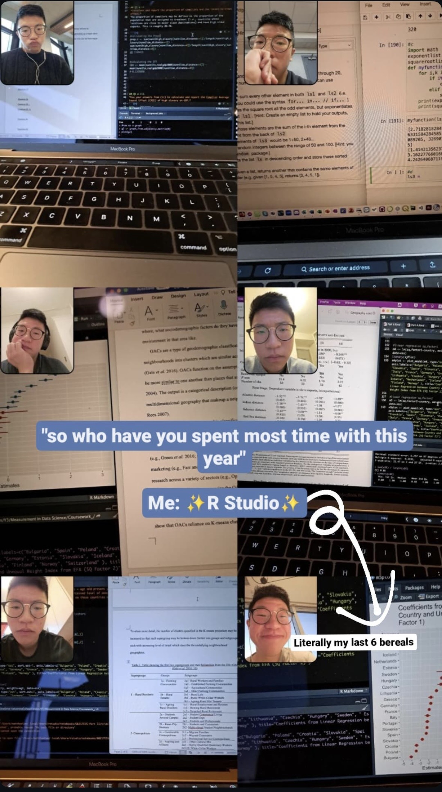

# On learning new programming languages for slow learners

This is a bit of a brain dump. Read at your own risk. 

I'm a slow learner. Give me enough time and I'll eventually get there, but there's usually a painful phase where everything feels unfamiliar. Most recently, that language was Julia, which I needed for a project at work.

These were a few things that helped: 

- [Julia for Nervous Beginners](https://www.youtube.com/playlist?list=PLP8iPy9hna6Qpx0MgGyElJ5qFlaIXYf1R). This is one of my fav courses ever

- Treaitng copilot like a tutor, asking it to explain things and make analogies to Python/R

- Avoiding giving up entirely and succumbing to relying on an [R Wrapper](https://matthewkling.github.io/circuitscaper/) that someone else made for exactly what you want to do but you realised it too late into the process, smashing your head against the table but you just gotta roll with it i guess. 

So in conclusion, I guess what I'm telling myself is that it's ok to be a slow learner, you just gotta sit with it and learn with examples. 

I like Julia. She's kinda cool. But spending too much time with Julia will probably drive you nuts. But that's also how I learned R (see below). Swings and roundabouts I suppose xoxo

