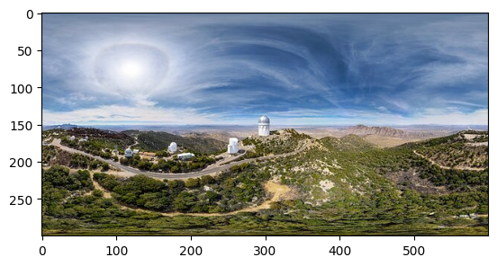
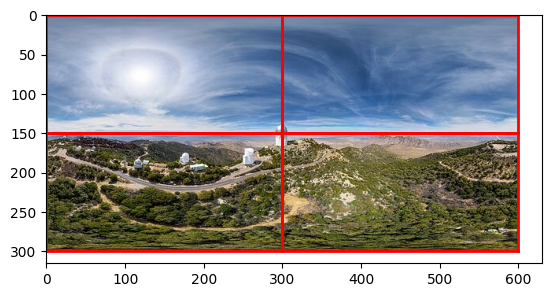
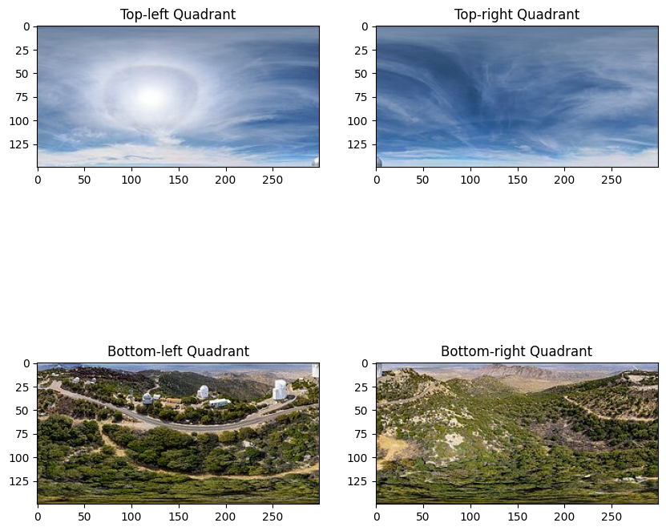
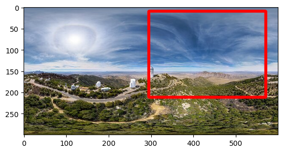

# Working with images in Python


### Load Libraries
We will be using a few libraries with good built-in functions for reading in images. 
```Python
import cv2
import numpy as np
from matplotlib import pyplot as plt
import imageio
import numpy as np
from PIL import Image
from scipy.ndimage import map_coordinates
```


### Loading in an image
We will use a dummy 360 - something I've just randomly found on the internet. Image was taken from [NOIRLab](https://noirlab.edu/public/images/archive/category/360pano/).

We can read this in as a numpy array using `cv2 `
```Python
path_to_image = r"assets/example360image.jpg"

#read in the image using cv2
image_360 = cv2.imread(path_to_image)

#here, we need to first set the image colour format for matplotlib as it's curently BGR. We need it to be RGB
image_360 = cv2.cvtColor(image_360, cv2.COLOR_BGR2RGB)

#plot
plt.imshow(image_360)
```



### Shape of the image
`image_360` is a numpy array, and it has 3 values in it's shape. We can inspect it using the `.shape` method. 
```Python
print(image_360.shape)  # (height, width, channels)
```
The output from above should be `(300, 600, 3)`, which means the image is 300 pixels tall, 600 pixels wide and there are 3 channels in the image. 

The 3 channels mean that each pixel has three colour channels (Red, Green and Blue). Each channel will have it's own value from 0 to 255, representing the intensity of that colour in the pixel. 

### Cropping an image (no correction for warp)
We can crop the image as is, without correcting for warp. 

Suppose we want to divide the image into 4 quadrants: Top left, top right, bottom left and bottom right. 

```Python
quadrants = [
    (0, 0, image_360.shape[1] // 2, image_360.shape[0] // 2),  # Top-left
    (image_360.shape[1] // 2, 0, image_360.shape[1], image_360.shape[0] // 2),  # Top-right
    (0, image_360.shape[0] // 2, image_360.shape[1] // 2, image_360.shape[0]),  # Bottom-left
    (image_360.shape[1] // 2, image_360.shape[0] // 2, image_360.shape[1], image_360.shape[0]),  # Bottom-right
]   
```

To visualise the quadrants on the image, we can run the below
```Python
#draw the quadrant lines on the image
plt.imshow(image_360)
for (x1, y1, x2, y2) in quadrants:
    plt.plot([x1, x2], [y1, y1], color='red', linewidth=2)  # Top line
    plt.plot([x1, x2], [y2, y2], color='red', linewidth=2)  # Bottom line
    plt.plot([x1, x1], [y1, y2], color='red', linewidth=2)  # Left line
    plt.plot([x2, x2], [y1, y2], color='red', linewidth=2)  # Right line

plt.show()
```


Let's crop the image according to the quadrants that we created above. 

```Python
#divide the image into 4 quadrants and display
quadrants = [
    (0, 0, image_360.shape[1] // 2, image_360.shape[0] // 2),  # Top-left
    (image_360.shape[1] // 2, 0, image_360.shape[1], image_360.shape[0] // 2),  # Top-right
    (0, image_360.shape[0] // 2, image_360.shape[1] // 2, image_360.shape[0]),  # Bottom-left
    (image_360.shape[1] // 2, image_360.shape[0] // 2, image_360.shape[1], image_360.shape[0]),  # Bottom-right
]   


q1_crop = image_360[quadrants[0][1]:quadrants[0][3], quadrants[0][0]:quadrants[0][2]]
q2_crop = image_360[quadrants[1][1]:quadrants[1][3], quadrants[1][0]:quadrants[1][2]]
q3_crop = image_360[quadrants[2][1]:quadrants[2][3], quadrants[2][0]:quadrants[2][2]]
q4_crop = image_360[quadrants[3][1]:quadrants[3][3], quadrants[3][0]:quadrants[3][2]]

plt.figure(figsize=(10, 10))
plt.subplot(2, 2, 1)
plt.imshow(q1_crop)
plt.title("Top-left Quadrant")
plt.subplot(2, 2, 2)
plt.imshow(q2_crop)
plt.title("Top-right Quadrant")
plt.subplot(2, 2, 3)
plt.imshow(q3_crop)
plt.title("Bottom-left Quadrant")
plt.subplot(2, 2, 4)
plt.imshow(q4_crop)
plt.title("Bottom-right Quadrant")
plt.show()

```



### Bounding Box Formats
Bounding box coordinates will come in two main forms: 
- XYXY: Top left X and Y coordinates, bottom right X and Y coordinates of the box.
- XYWH: The top left X and Y coordinates (origin) and the width and height of the box. 

These can also come in absolute coordinate format(where the coordinates are relative to the true pixel position in the image), or normalised format (where the coordinates are normalised to the width and height of the image and go from 0 to 1). 

| Format | Absolute | Normalised|
|--------|----------|-----------|
| XYXY | `[649, 671, 775, 1126]` |`[0.3382475845116023, 0.3498533770268592, 0.40376361865331395, 0.5866210660303719]`|
| XYWH | `[712.0, 898.5, 126, 455]` | `[0.37083333333333335, 0.46796875, 0.065625, 0.23697916666666666]`|


To go from XYXY to XYWH, we can use the following function
```Python
def xyxy_to_xywh(box):
    """
    Convert bounding box from (x1, y1, x2, y2) format to (x, y, w, h) format.

    Parameters:
    - box (list of float): The bounding box coordinates as a list [x1, y1, x2, y2].

    Returns:
    - list of float: The bounding box coordinates in (x, y, w, h) format.
    """
    x1, y1, x2, y2 = box
    w = x2 - x1
    h = y2 - y1
    x = x1 + w / 2
    y = y1 + h / 2
    return [x, y, w, h]

#Suppose our bounding box has an absolute coordinates in XYXY of: 
box_xyxy = [649, 671, 775, 1126]

box_xywh = xyxy_to_xywh(box) # [712.0, 898.5, 126, 455]
```


### Drawing the bounding box on the image
Let's say we have a bounding box with the following absolute coordinates that we would like to draw on the image `[188, 13, 581, 164]`. We can draw it directly using cv2. 

```Python
bbox_xyxy = [188, 13, 581, 164]

plt.imshow(image_360)

#using cv2.rectangle and drawing the coordinates directly on it. Colour specify red, and thickness of 5. 
cv2.rectangle(image_360, (box_xyxy[0], box_xyxy[1]), (box_xyxy[2], box_xyxy[3]), (255, 0, 0), 5)

plt.show()
```
