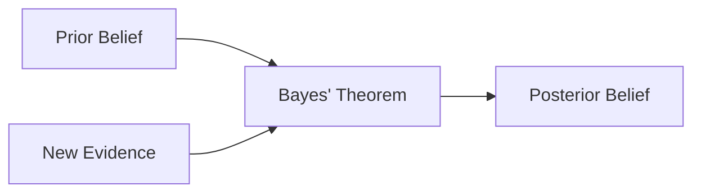
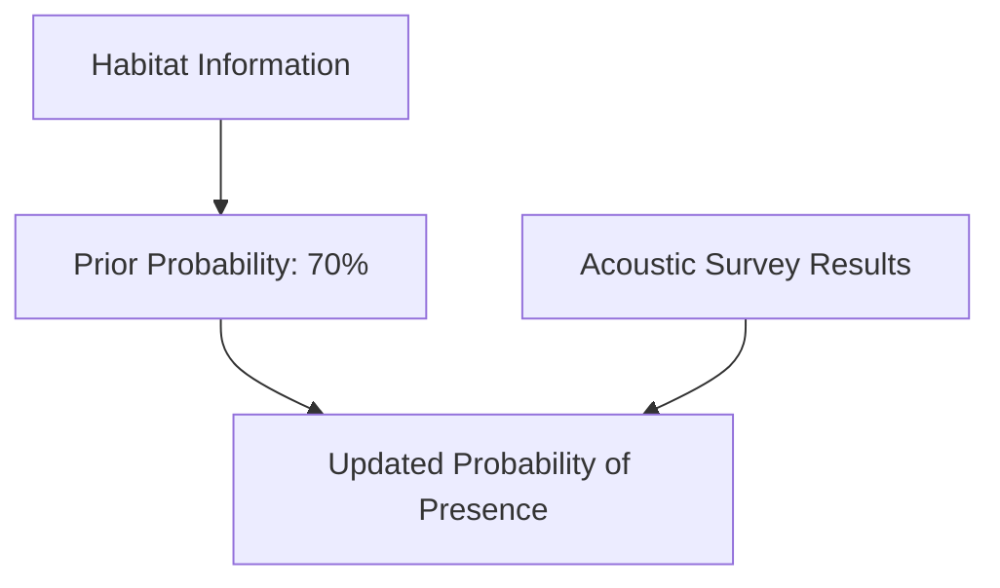
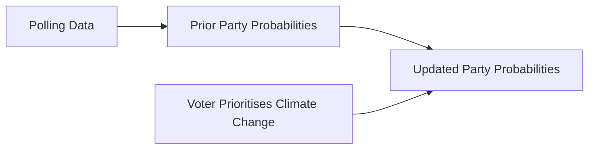
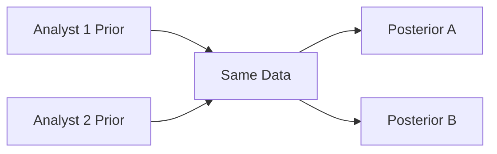
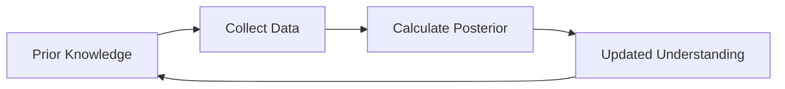

# A Crash Course on Bayesian Statistics

Recently, I worked on several projects where we used bayesian models for prediction. I've had to explain bayesian statistics to many stakeholders (with varying degrees of compleixty) so I thought it would be helpful to formalise this into a little crash course. 


---

## Introduction 

Bayesian statistics provides a framework for updating our beliefs as new evidence becomes available. 

Rather than treating parameters as fixed but unknown values, Bayesian methods treat them as probabilities that can change as new information is observed.

The key question for Bayesian stats is: 

???+ question 
    "Given what I already know, and given the new evidence I have collected, what should I believe now?"

## How is Bayesian Different to Frequentist Statistics?

The main difference is how probability is interpreted.

### Frequentist Statistics

Frequentist statistics views probability as the long-run frequency of events.

For example:

???+ question
    "If we repeated an experiment thousands of times, how often would a particular outcome occur?"

Unknown quantities (such as a regression coefficient or population mean) are considered fixed values. We estimate them using data and quantify uncertainty through confidence intervals and p-values.

### Bayesian Statistics

Bayesian statistics views probability as a degree of belief.

For example:
???+ question 
    "Given what I know right now, how likely is it that this statement is true?"

Unknown quantities are represented as probability distributions rather than fixed values.

As new data becomes available, our beliefs are updated.

### Example: Smoking and Lung Cancer

Imagine you have two patients: 
- **Patient A**: Never smoked
- **Patient B**: Chian smoked for 40 years. 

Before we conduct any medical tests, which patient do you think you'd be more concerned about just based on those two pieces of information? Intuitively, you would say **Patient B** immediately. This is because we already know that smoking is a major risk factor for lung cancer, so this existing knowledge forms our **prior belief**. 

Suppose both patients go for scan which scans for lung cancer. The scan provides us with **new evidence**. 

So, bayesian statistics combines what we already know (patiet's smoking history) and new evidence we have just observed (scan results) to calculate an updated probability for lung cancer. 

- A Frequentist asks: *"If someone has lung cancer, how often would this scan produce a positive result"*
- A Bayesian asks: *"Given that this patient is a long-term smoker and has a positive scan, what is the probability they have lung cancer?"*

### Comparing the Two Approaches

| Question | Frequentist | Bayesian |
|-----------|-------------|-----------|
| What is probability? | Long-run frequency | Degree of belief |
| Parameters | Fixed but unknown | Probability distributions |
| Prior knowledge | Not formally included | Explicitly incorporated |
| Typical outputs | p-values, confidence intervals | Posterior distributions, credible intervals |
| Interpretation | Probability of the data | Probability of the hypothesis |

---

## Bayes' Theorem

Bayesian inference is built upon Bayes' Theorem:

$$
P(A \mid B)=\frac{P(B \mid A)P(A)}{P(B)}
$$

Where:

| Term | Meaning |
|--------|---------|
| \(P(A)\) | Prior belief |
| \(P(B \mid A)\) | Likelihood of observing the evidence |
| \(P(B)\) | Probability of observing the evidence |
| \(P(A \mid B)\) | Updated belief (Posterior) |

Often summarised as:

$$
\text{Posterior} \propto \text{Likelihood} \times \text{Prior}
$$

### Bayesian Updating



The posterior from one analysis can become the prior for the next, allowing knowledge to accumulate over time.

---

## Example 1: Predicting the Presence of a Species in an Area

Suppose an we are assessing whether a rare bat species is present within a woodland.

### Prior Knowledge

Based on historical surveys in similar habitats, we know that:

> Probability the species is present = 70%

```text
Prior = 0.70
```

### New Evidence

An acoustic detector records several calls matching the target species.

Previous validation studies show:

> If the species is present, the detector identifies it correctly 90% of the time.

### Bayesian Update

The new evidence increases our confidence that the species is present.



Unlike a simple "present" or "absent" classification, Bayesian analysis provides a probability that reflects both historical knowledge and newly collected evidence.

---

## Example 2: Predicting Voter Choice

Imagine we want to predict which UK political party a voter is most likely to support.

### Prior Beliefs

Before speaking to the voter, we might use national polling data:

| Party | Prior Probability |
|---------|---------|
| Labour | 40% |
| Conservative | 25% |
| Liberal Democrat | 15% |
| Green | 10% |
| Other | 10% |

### New Evidence

The voter tells us:

> "Climate change is my most important issue."

Historically, voters who prioritise climate issues are more likely to support the Green Party or Labour than the Conservatives.

### Posterior Beliefs

After updating our beliefs:

| Party | Updated Probability |
|---------|---------|
| Labour | 45% |
| Conservative | 10% |
| Liberal Democrat | 15% |
| Green | 25% |
| Other | 5% |

### Bayesian Voting Example



Bayesian inference combines existing knowledge with new evidence to produce a revised estimate of what is most likely.

---

## Limitations of Bayesian Statistics

Bayesian methods are powerful, but they are not always the best choice.

### 1. Priors Can Be Subjective

Bayesian models require prior assumptions.

Different analysts may choose different priors, which can lead to different conclusions, particularly when little data is available.



When datasets are small, results may be strongly influenced by these prior assumptions.

---

### 2. Computationally Intensive

Many Bayesian models require simulation methods such as:

- Markov Chain Monte Carlo (MCMC)
- Hamiltonian Monte Carlo (HMC)
- Variational Inference

These can be significantly more computationally expensive than equivalent frequentist methods.

For large datasets or highly complex models, run times can become substantial.

---

### 3. Results Can Be Sensitive to Model Specification

Bayesian models require decisions about:

- Priors
- Likelihood functions
- Hierarchical structures

Poorly chosen assumptions can bias results, particularly when data is limited.

---

### 4. Frequentist Methods Are Often Simpler

For many routine analyses:

- Two-sample t-tests
- Linear regression
- ANOVA
- Chi-squared tests

Frequentist approaches are often easier to implement, explain and reproduce.

If the objective is simply to estimate a parameter using a large dataset, a frequentist solution may be perfectly adequate.

---

## Why Bayesian Statistics is Useful

Despite its limitations, Bayesian statistics offers several compelling advantages:

- Prior knowledge can be formally incorporated into analysis.
- Probabilities are intuitive and easy to interpret.
- Uncertainty is represented naturally through probability distributions.
- Predictions can be continuously updated as new information becomes available.
- Complex hierarchical and multi-level systems can be modelled effectively.

### Bayesian Learning Cycle



---