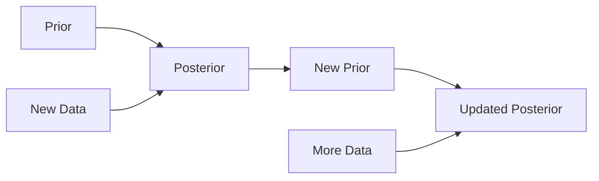
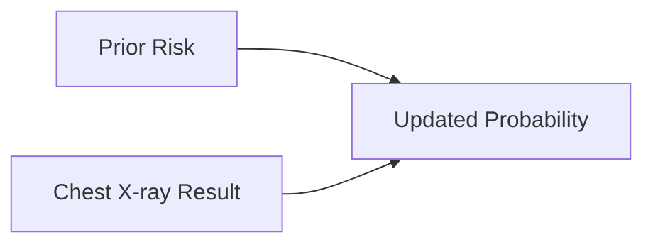
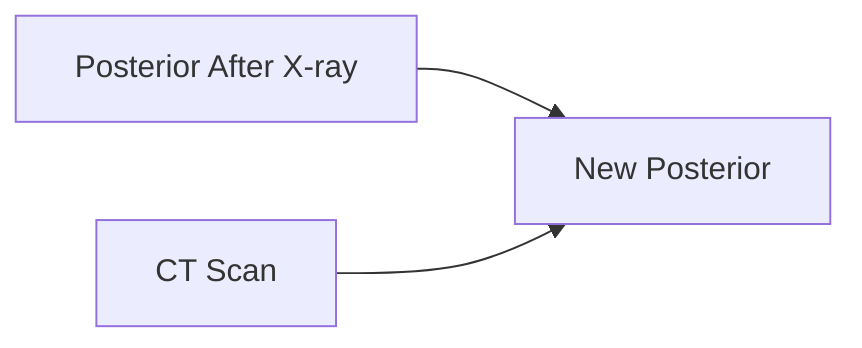
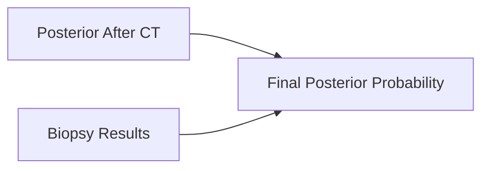

# Bayesian Sequential Updating

One of the most powerful features of Bayesian statistics is that it allows us to continuously update our beliefs as new evidence becomes available.

In Bayesian Sequential Updating, the posterior distribution from today becomes the prior distribution for tomorrow.

Rather than analysing all available data from scratch every time new information arrives, we  update our existing beliefs with the latest evidence.

---

## Key Intuition

Bayesian inference follows a simple principle:

$$
\text{Posterior} \propto \text{Likelihood} \times \text{Prior}
$$

When a new observation becomes available:

1. Start with a prior belief.
2. Collect new evidence.
3. Calculate a posterior belief.
4. Treat the posterior as the new prior.
5. Repeat.

### Sequential Updating Process




---

## Example: Smoking and Lung Cancer

I am diagnosing an individual for lung cancer. 

### Step 1: Prior Belief

The individual is a chain smoker who has smoked for 40 years.

Based on historical evidence, we already believe:

> This patient has a higher risk of lung cancer than the average person.

This forms the **prior probability**.


---

### Step 2: New Evidence Arrives

A chest X-ray reveals a suspicious shadow.

We can update our belief. 



The resulting probability is called the **posterior probability**.

---

### Step 3: More Evidence Arrives

A CT scan is performed.

Instead of returning to the beginning and ignoring what has already been learned, we can use the previous posterior as the new prior.



Risk estimates are refined further.

---

### Step 4: A Biopsy Result Arrives

Finally, a biopsy is performed.

Again, the previous posterior becomes the new prior.



At each stage, the estimate becomes more informed because it incorporates all previous evidence.

---

## Why Sequential Updating Is Useful

Traditional statistical analysis often works like this:

```text
Collect all data
↓
Run analysis
↓
Generate result
```

Bayesian Sequential Updating works differently:

```text
Observation 1 → Update
Observation 2 → Update
Observation 3 → Update
Observation 4 → Update
...
```

This is good for when information arrives gradually over time, or we have varying degrees of confidence on our observations.

---

## Real-World Applications

### Ecology

Suppose we want to determine whether a rare bat species is present.

Evidence may arrive in stages:

1. Habitat assessment
2. Acoustic recordings
3. Emergence surveys
4. eDNA sampling

Each survey incrementally updates our confidence in species presence.

---

### Asset Management

Sequential updating is particularly useful for infrastructure assets.

An asset may initially have a baseline health assessment.

Over time, new information arrives from:

- Visual examinations
- Train bourne monitoring systems
- LiDAR surveys
- Sensors
- Failure records

Each observation can update the estimated asset condition rather than requiring a complete rebuild of the model.

---

## Visualising Belief Updating

A useful way to think about Bayesian updating is as a process of reducing uncertainty.


As more evidence accumulates:

- Uncertainty decreases.
- The posterior distribution becomes more concentrated (i.e., the distribution is less wide as we are more confident about where we'll end up).
- Our estimates become more precise.

---