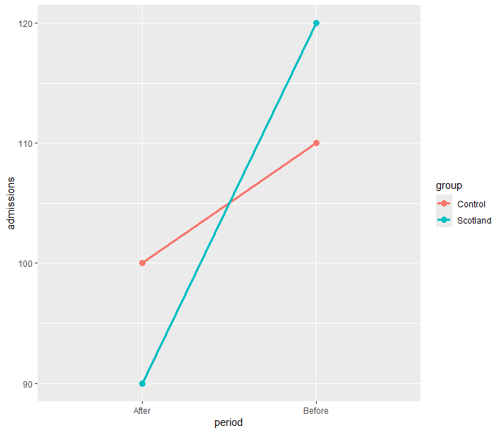

# Difference-in-Differences: Estimating Causal Effects Without a Randomised Trial

I actually wrote my dissertation using DiD (and synthetic control) so this is a super exciting topic for me! 

One of the biggest challenges in statistics is determining whether an intervention actually caused a change in outcomes.

Suppose a government introduces a public smoking ban and wants to know whether it improved population health. We can compare health outcomes before and after the ban, but outcomes may have changed anyway due to improvements in healthcare, public awareness campaigns, or broader societal trends.

**Difference-in-Differences (DiD)** is a popular technique that helps estimate causal effects using observational data.

---

# The Core Idea

Difference-in-Differences compares:

1. The change in outcomes for a group exposed to an intervention (**treatment group**)
2. The change in outcomes for a comparable group not exposed (**control group**)

Rather than comparing levels, we compare **changes over time**.

This helps account for factors that affect both groups equally.

---

# A Simple Example

Suppose Scotland introduces a smoking ban in public places, whilst another comparable region does not.

Researchers measure the annual rate of hospital admissions for respiratory illness (per 10,000 people).

| Group | Before Ban | After Ban |
|---------|---------|---------|
| Scotland (Treatment) | 120 | 90 |
| Control Region | 110 | 100 |

At first glance, admissions in Scotland fell by:

```text
120 - 90 = 30
```

admissions per 10,000 people.

However, admissions also fell in the control region:

```text
110 - 100 = 10
```

admissions per 10,000 people.

The Difference-in-Differences estimate is:

```text
(90 - 120) - (100 - 110)
```

```text
-30 - (-10)
```

```text
-20
```

Interpretation:

> After accounting for wider trends, the smoking ban is estimated to have reduced respiratory hospital admissions by an additional 20 admissions per 10,000 people.

---

# Why Not Just Compare Before and After?

If we only looked at Scotland:

| Time | Admissions |
|---------|---------|
| Before | 120 |
| After | 90 |

we would conclude that the smoking ban reduced admissions by 30.

But this ignores the fact that admissions were already falling elsewhere.

Difference-in-Differences attempts to isolate the additional change attributable to the intervention itself.

---

# A Regression Formulation

Difference-in-Differences is usually implemented using a regression model.

Suppose we have:

- `admissions` = hospital admission rate
- `treated` = Scotland (1) or Control Region (0)
- `post` = After Ban (1) or Before Ban (0)

The model is:

$$
Admissions = \beta_0 + \beta_1 \text{treated} + \beta_2 \text{post} + \beta_3 (\text{treated} \times \text{post}) + \epsilon
$$

The coefficient:

$$
\beta_3
$$

is the Difference-in-Differences estimate.

This is the estimated impact of the smoking ban.

---

# Example in R

Let's create a simple toy dataset.

```r
df <- data.frame(
  admissions = c(120, 90, 110, 100),
  treated = c(1, 1, 0, 0),
  post = c(0, 1, 0, 1)
)

model <- lm(
  admissions ~ treated * post,
  data = df
)

summary(model)
```

The coefficient for:

```text
treated:post
```

represents the Difference-in-Differences estimate.

The summary shows: 
```
Call:
lm(formula = admissions ~ treated * post, data = df)

Residuals:
ALL 4 residuals are 0: no residual degrees of freedom!

Coefficients:
             Estimate Std. Error t value Pr(>|t|)
(Intercept)       110        NaN     NaN      NaN
treated            10        NaN     NaN      NaN
post              -10        NaN     NaN      NaN
treated:post      -20        NaN     NaN      NaN

Residual standard error: NaN on 0 degrees of freedom
Multiple R-squared:      1,	Adjusted R-squared:    NaN 
F-statistic:   NaN on 3 and 0 DF,  p-value: NA
```
If the coefficient equals:

```text
-20
```

it suggests that the smoking ban reduced respiratory admissions by an additional 20 admissions per 10,000 people relative to the control region.

---

# Understanding the Interaction Term

The term:

```r
treated * post
```

expands to:

```r
treated + post + treated:post
```

The interaction term measures:

> How much more (or less) the treatment group changed after the intervention compared with the control group.

In other words, DiD is fundamentally an interaction model.

---

# The Parallel Trends Assumption

The most important assumption in Difference-in-Differences is the **parallel trends assumption**.

It states:

> In the absence of the smoking ban, the treatment and control regions would have experienced similar trends in respiratory admissions.

The groups do **not** need to start at the same level.

Instead, they need to be moving in roughly the same direction before the intervention.

If this assumption is violated, the DiD estimate may be biased.

---

# Visualising Difference-in-Differences

A graph often makes the concept easier to understand.

```r
library(ggplot2)

df <- data.frame(
  period = rep(c("Before", "After"), 2),
  group = rep(c("Scotland", "Control"), each = 2),
  admissions = c(120, 90, 110, 100)
)

ggplot(df,
       aes(period,
           admissions,
           colour = group,
           group = group)) +
  geom_line(linewidth = 1.2) +
  geom_point(size = 3)
```


The treatment effect appears as a widening or narrowing gap between the two lines after the intervention.

---

# Strengths and Limitations

## Strengths

- Simple and intuitive.
- Allows causal inference without a randomised trial.
- Controls for fixed differences between groups.
- Widely used in economics, public health, and policy evaluation.

## Limitations

- Relies heavily on the parallel trends assumption.
- Sensitive to other events that affect only one group.
- Requires a suitable control group.
- Cannot fully eliminate all sources of bias.

---

# Key Takeaways

- Difference-in-Differences estimates the impact of an intervention by comparing changes over time between treatment and control groups.
- It is commonly used to evaluate public policies such as smoking bans, tax changes, and healthcare interventions.
- The treatment effect is captured by an interaction term in a regression model.
- The validity of the approach depends largely on the parallel trends assumption.
- When the assumptions are reasonable, Difference-in-Differences can provide powerful evidence of causal effects using observational data.