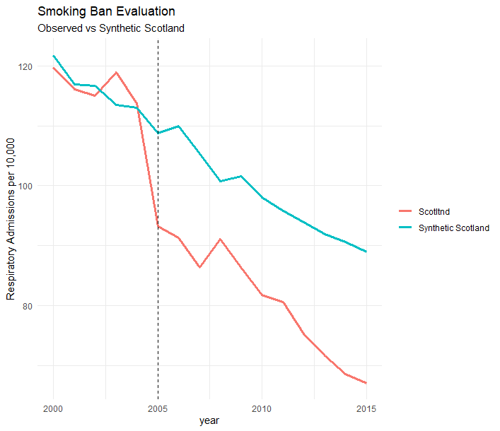
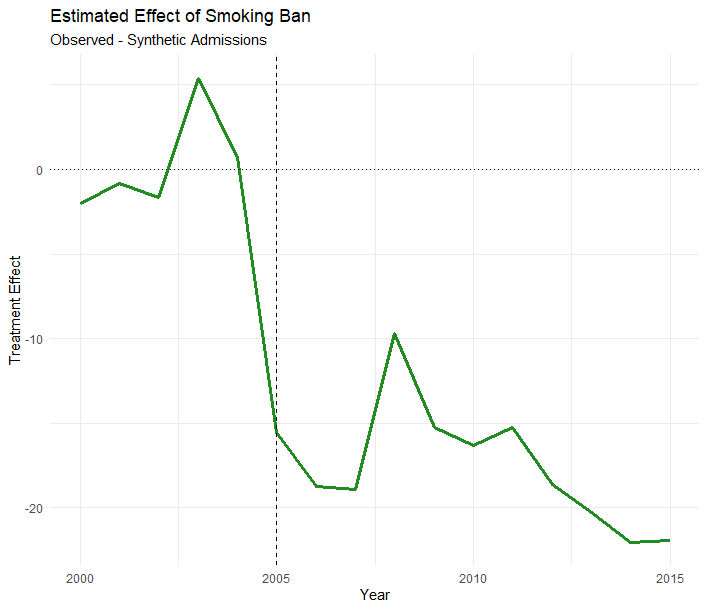

<<<<<<< HEAD
# Synthetic Control Analysis: Building a Counterfactual
=======
# Synthetic control analysis
>>>>>>> main

This is one of the COOLEST causal analysis methods in my opnion. Very underrated and only just beginning to become popular in social science research. 

When evaluating the impact of a policy or intervention, one of the biggest challenges is answering the question:

> What would have happened if the intervention had never occurred?

In an ideal world, we'd run a randomised experiment. In reality, many interventions occur at the level of a city, region, or country, making randomisation impossible.

**Synthetic Control Analysis** is a causal inference technique designed for these situations. Rather than finding a single comparison group, it creates a weighted combination of multiple control units to construct a **synthetic version** of the treated unit.

---

# The Core Idea

Suppose Scotland introduces a public smoking ban and we want to know whether it reduced hospital admissions for respiratory illness.

A simple question arises:

> Which region should we compare Scotland with?

No single region is likely to be a perfect match.

Instead, Synthetic Control Analysis constructs a weighted combination of other regions:

| Region | Weight |
|----------|----------|
| Wales | 0.50 |
| Northern Ireland | 0.30 |
| North East England | 0.20 |

Together, these regions form **Synthetic Scotland**.

The weights are chosen to ensure that, before the smoking ban, Synthetic Scotland looks as similar as possible to Scotland.

---

# A Smoking Ban Example

Imagine we observe respiratory hospital admissions per 10,000 people.

| Year | Scotland | Synthetic Scotland |
|--------|--------|--------|
| 2000 | 120 | 121 |
| 2001 | 118 | 117 |
| 2002 | 115 | 116 |
| 2003 | 111 | 112 |
| 2004 | 108 | 109 |
| **2005 (Smoking Ban)** | **95** | **106** |
| 2006 | 90 | 104 |
| 2007 | 87 | 103 |

Before the ban:

- Scotland and Synthetic Scotland follow almost identical trends.

After the ban:

- The two lines diverge substantially.

This suggests that the smoking ban may have reduced respiratory admissions.

---

# Estimating the Treatment Effect

The estimated treatment effect is:

$$
\text{Observed Outcome}
-
\text{Synthetic Outcome}
$$

For 2007:

$$
87 - 103 = -16
$$

Interpretation:

> Respiratory admissions were 16 admissions per 10,000 lower than we would have expected without the smoking ban.

The synthetic control serves as our estimated counterfactual.

---

# Why Not Use Difference-in-Differences?

Difference-in-Differences requires finding a suitable control group and assumes that treatment and control groups would have followed parallel trends.

Synthetic controls take a different approach.

Rather than choosing one comparison group, they construct the best possible combination of comparison groups using historical data.

Difference-in-Differences asks:

> Who should Scotland be compared against?

Synthetic Controls ask:

> Which combination of regions most closely resembles Scotland?

---

# Synthetic Control in R

We can use the package `Synth` for synthetic control analysis.

Suppose we have annual respiratory admission data for several regions, where:

- Region 1 = Scotland (treated)
- Regions 2–5 = donor pool regions
- Smoking ban introduced in 2005
---

#### Creating the dummy dataset
```r
library(Synth)
library(ggplot2)

set.seed(123)

# Create panel dataset
years <- 2000:2015
regions <- c(
  "Scotland",
  "Wales",
  "Northern Ireland",
  "North East",
  "Midlands",
  "North West"
)

df <- expand.grid(
  year = years,
  region_name = regions,
  stringsAsFactors = FALSE
)

# Region IDs required by Synth
df$region <- as.numeric(
  factor(df$region_name)
)

# Region specific effects
region_effect <- c(
  Scotland = 15,
  Wales = 10,
  `Northern Ireland` = 12,
  `North East` = 14,
  Midlands = 8,
  `North West` = 11
)

# Smoking rate predictor
df$smoking_rate <-
  25 -
  0.2 * (df$year - 2000) +
  region_effect[df$region_name] / 10 +
  rnorm(nrow(df), 0, 0.5)

# Income predictor
df$income <-
  30000 +
  500 * (df$year - 2000) +
  region_effect[df$region_name] * 50 +
  rnorm(nrow(df), 0, 500)

# Outcome: respiratory admissions
df$admissions <-
  120 -
  1.5 * (df$year - 2000) +
  1.2 * df$smoking_rate -
  0.001 * df$income +
  rnorm(nrow(df), 0, 2)

# Smoking ban from 2005 onwards
ban_rows <- df$region_name == "Scotland" &
            df$year >= 2005

df$admissions[ban_rows] <-
  df$admissions[ban_rows] -
  15 -
  0.5 * (df$year[ban_rows] - 2005)

# Verify structure
str(df)
```

The dummy daatset looks like this
```
  year region_name region smoking_rate   income admissions
1 2000    Scotland      5     26.21976 31843.67  119.80922
2 2001    Scotland      5     26.18491 32016.31  116.11486
3 2002    Scotland      5     26.87935 31632.15  115.00147
4 2003    Scotland      5     25.93525 31736.79  118.87994
5 2004    Scotland      5     25.76464 32394.80  113.72419
6 2005    Scotland      5     26.35753 33378.44   93.24805
```


#### Preparing the data for Synth
Synth has quite strict rules about what the data wlil need to look like: 
```r
treated_id <- unique(
  df$region[df$region_name == "Scotland"]
)

control_ids <- unique(
  df$region[df$region_name != "Scotland"]
)

dataprep.out <- dataprep(
  foo = df,

  predictors = c(
    "smoking_rate",
    "income"
  ),

  predictors.op = "mean",

  dependent = "admissions",

  unit.variable = "region",

  # IMPORTANT:
  # Synth expects the COLUMN NUMBER,
  # not the column name

  unit.names.variable =
    which(names(df) == "region_name"),

  time.variable = "year",

  treatment.identifier = treated_id,

  controls.identifier = control_ids,

  time.predictors.prior = 2000:2004,

  time.optimize.ssr = 2000:2004,

  special.predictors = list(
    list("admissions", 2000, "mean"),
    list("admissions", 2001, "mean"),
    list("admissions", 2002, "mean"),
    list("admissions", 2003, "mean"),
    list("admissions", 2004, "mean")
  ),

  time.plot = 2000:2015
)
```

#### Fit the Synthetic Control 
```r
synth.out <- synth(dataprep.out)
```


#### Examine the donor weights
```r
weights <- synth.tab(
  dataprep.res = dataprep.out,
  synth.res = synth.out
)

weights$tab.w
```
```
  w.weights       unit.names unit.numbers
1     0.000            Wales            6
2     0.000 Northern Ireland            4
3     0.681       North East            2
4     0.319         Midlands            1
6     0.000       North West            3
```

#### Results
```r
results <- data.frame(
  year = 2000:2015,
  Scotland = dataprep.out$Y1plot,
  Synthetic =
    dataprep.out$Y0plot %*%
    synth.out$solution.w
)

head(results)
```

```
     year        X5 w.weight
2000 2000 119.80922 121.8069
2001 2001 116.11486 116.9201
2002 2002 115.00147 116.6477
2003 2003 118.87994 113.4860
2004 2004 113.72419 113.0058
2005 2005  93.24805 108.8074
```


#### Plotting the results
```r
plot_df <- rbind(
  data.frame(
    year = results$year,
    admissions = results$X5,
    series = "Scotltnd"
  ),
  data.frame(
    year = results$year,
    admissions = results$w.weight,
    series = "Synthetic Scotland"
  )
)

ggplot(
  plot_df,
  aes(
    x = year,
    y = admissions,
    colour = series
  )
) +
  geom_line(linewidth = 1.2) +
  geom_vline(
    xintercept = 2005,
    linetype = "dashed"
  ) +
  labs(
    title = "Smoking Ban Evaluation",
    subtitle = "Observed vs Synthetic Scotland",
    x = "year",
    y = "Respiratory Admissions per 10,000",
    colour = NULL
  ) +
  theme_minimal()

```

From this plot, we can see Scotland and Synthetic Scotland tracking closely between 2000 and 2004. There is a divergence after 2005 when the smoking ban is introduced.

#### Plotting the estimated treatment effect
```r
results$effect <-
  results$X5 -
  results$w.weight

ggplot(
  results,
  aes(year, effect)
) +
  geom_line(
    colour = "forestgreen",
    linewidth = 1.2
  ) +
  geom_hline(
    yintercept = 0,
    linetype = "dotted"
  ) +
  geom_vline(
    xintercept = 2005,
    linetype = "dashed"
  ) +
  labs(
    title = "Estimated Effect of Smoking Ban",
    subtitle = "Observed - Synthetic Admissions",
    x = "Year",
    y = "Treatment Effect"
  ) +
  theme_minimal()
```

Here we see that effect is close to zero before 2005 (good pre-treatment fit).There is a negative effect after 2005, indicating that respiratory admissions are lower than would have been expected without the smoking ban.


# The Importance of Pre-Intervention Fit

The credibility of a synthetic control analysis depends heavily on how well the synthetic control reproduces the treated unit **before** treatment.

A good analysis should show:

- Similar pre-treatment levels
- Similar trends
- Similar responses to historical shocks

A common principle is:

> No pre-treatment fit, no credible causal inference.

If Synthetic Scotland does not resemble Scotland prior to the smoking ban, any estimated treatment effect should be treated with caution.

---

# Strengths and Limitations

## Strengths

- Provides an explicit counterfactual.
- Useful when there is only one treated unit.
- Data-driven construction of control groups.
- Often more transparent than complex regression models.
- Widely used in economics, epidemiology, and public policy.

## Limitations

- Requires suitable control regions.
- Sensitive to poor pre-intervention fit.
- Results can depend on the donor pool available.
- Less useful when many units receive treatment simultaneously.

---