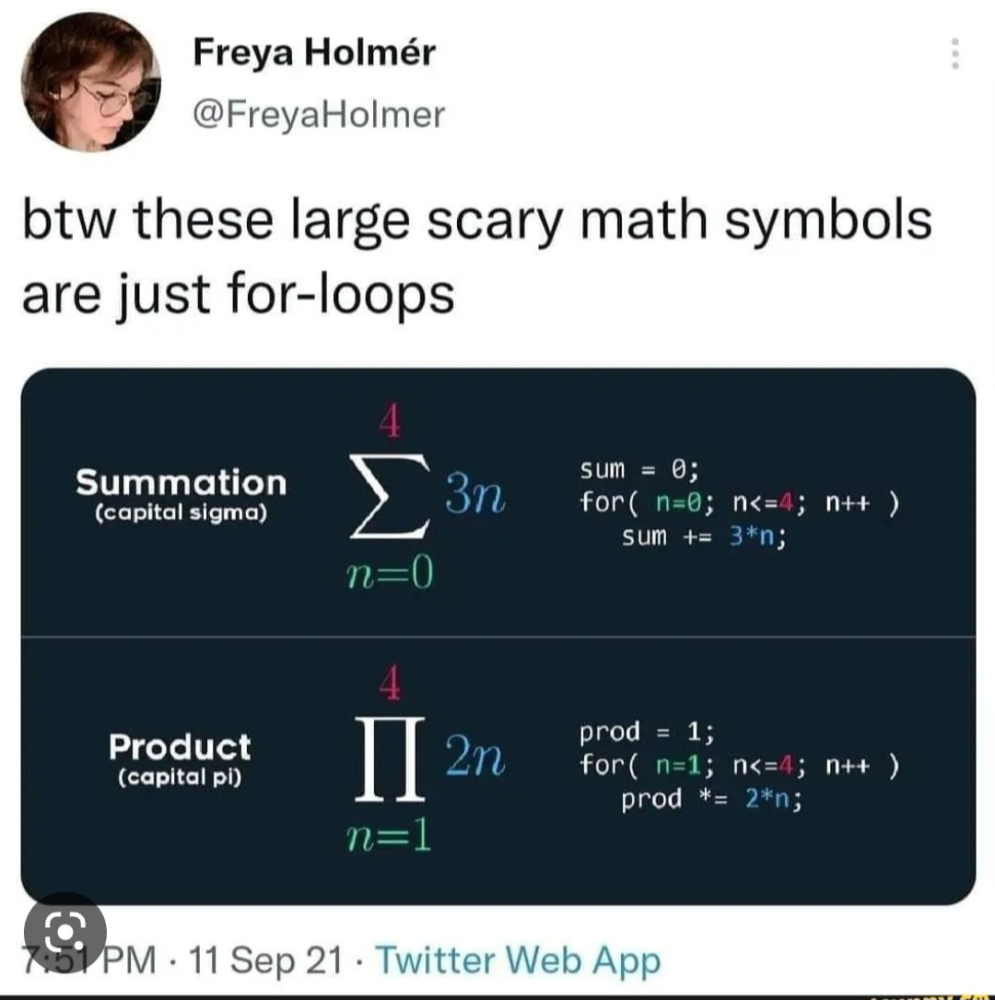

# Stats shouldn't be scary!

I used to be really bad at maths. Absolutely hated it at school and really struggled with sitting down and doing my maths homework. 

That changed when I went to university though, and I was shown how maths, statistics and logic can be used to solve real world problems! Suddently statistics wasn't just about formulas and equaitons. It was about answering interesting questions, making predictions and understanding how the world works. 

Everyone's journey through stats and maths is different. I certainly took (and still take) a while to get to grips with fundamental concepts.

This section of my blog contains some explainers and tutorials on fundamental stats concepts I wish I had whilst studying/working. Hopefully this will help you along your statistical journey too! 

